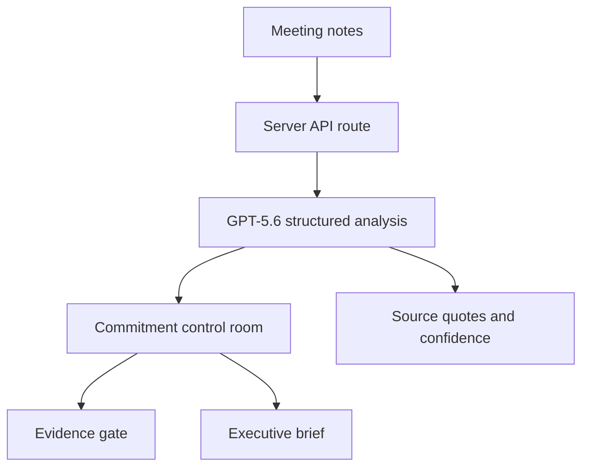

# ActionProof AI

**Turn conversation into accountable, evidence-backed execution.**

ActionProof AI is an execution-control agent built for OpenAI Build Week. It transforms unstructured meeting notes into traceable commitments, detects accountability gaps, defines the proof required for completion, and creates a concise executive decision brief.

**Track:** Work & Productivity  
**Live demo:** https://actionproof-ai.israa-alkamshki.chatgpt.site

## The problem

Teams leave meetings with actions scattered across notes, inboxes, and trackers. Owners or deadlines are often missing, risks surface late, and work may be reported as complete without evidence. Leaders then spend time reconstructing the truth instead of making decisions.

## What ActionProof does

1. Accepts meeting notes or a transcript.
2. Uses GPT-5.6 to extract source-grounded commitments.
3. Identifies owners, deadlines, ambiguity, blockers, and execution risk.
4. Defines the concrete proof required before each action can be considered complete.
5. Links every action to its source quote and confidence score.
6. Verifies submitted completion evidence.
7. Produces an executive brief focused on decisions and intervention.

## Why it is different

Most task tools track what people type. ActionProof examines what was actually agreed, exposes what is missing, and separates a completion claim from completion proof. It is designed as a human-in-the-loop control layer: users can inspect the source behind every extracted commitment rather than blindly accepting AI output.

## Core experience

- **Capture:** paste notes or load the synthetic demonstration.
- **Control room:** review commitments, owners, dates, risks, clarity gaps, and evidence status.
- **Evidence gate:** compare a completion note with the proof standard.
- **Executive brief:** turn detailed actions into a leadership decision signal.
- **Graceful demo mode:** the synthetic workflow remains testable when an API key is not configured; the interface clearly labels demo versus live reasoning.

## Architecture



The OpenAI API key is read only by the server from `OPENAI_API_KEY`. It is never included in client code, committed to the repository, or returned to the browser.

## OpenAI integration

`app/api/analyze/route.ts` calls the OpenAI Responses API with GPT-5.6 and a strict JSON schema. The prompt requires the model to:

- extract only source-supported commitments;
- use explicit placeholders when owners or dates are absent;
- distinguish risk from missing clarity;
- define a proof standard for every commitment;
- return a short source quotation;
- avoid invented names, dates, claims, or evidence.

## Run locally

### Prerequisites

- Node.js 22.13 or later
- An OpenAI API key with API billing enabled

### Setup

```bash
npm install
export OPENAI_API_KEY="your-key-here"
npm run dev
```

Open the local URL printed by the development server.

Never commit an API key. For production, store `OPENAI_API_KEY` as a secret environment variable in the hosting platform.

## Validation

```bash
npm run lint
npm run build
npm test
```

The project has been tested across the complete demonstration journey: capture, extraction, risk review, evidence verification, metric updates, and executive brief generation.

## Synthetic data and privacy

The included Atlas efficiency initiative is entirely synthetic. It contains no employer information, confidential meeting content, personal data, or proprietary operational data. Users should follow their organization’s data-handling policies before processing real content.

## Built with Codex

Codex accelerated the project from concept to deployable product by helping:

- translate a real operational pain point into a focused product journey;
- implement the responsive interface and interaction model;
- design the GPT-5.6 structured-output contract and safety constraints;
- diagnose and test the complete workflow in a browser;
- validate the production build and deployment;
- prepare documentation and the submission narrative.

Key decisions remained human-led: selecting the problem, prioritizing evidence-backed completion, defining the executive workflow, and refining the product around real business-performance work.

## Repository guide

- `app/page.tsx` — interactive product experience
- `app/globals.css` — responsive visual system
- `app/api/analyze/route.ts` — server-side GPT-5.6 integration
- `docs/DEMO_SCRIPT.md` — sub-three-minute video plan
- `docs/SUBMISSION.md` — Devpost-ready project narrative

## License

MIT — see [LICENSE](LICENSE).
